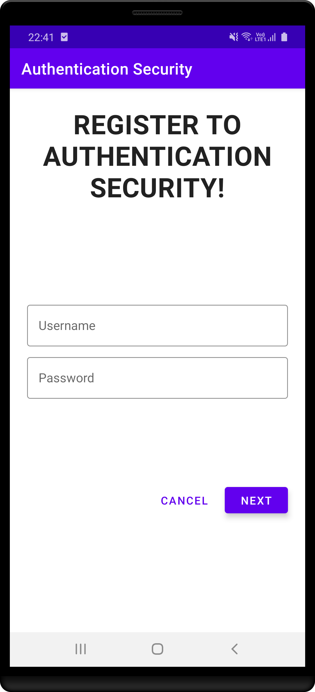
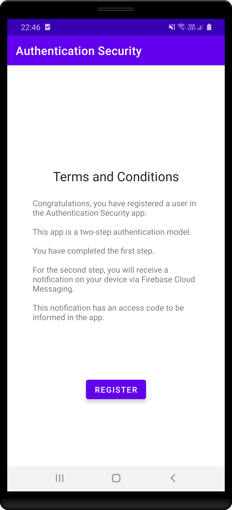
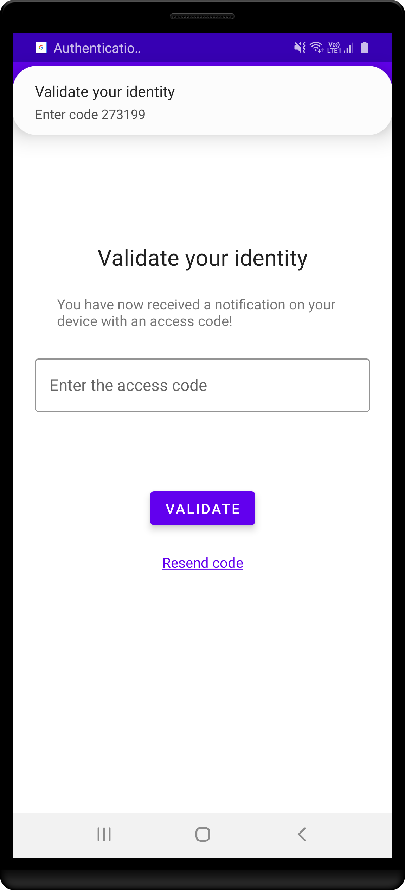
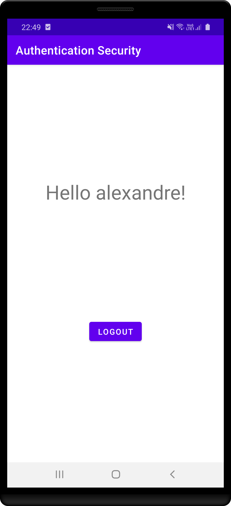
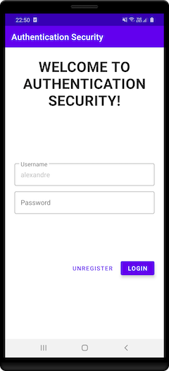

Authentication Security
=================

Screenshots
-----------

Libraries Used
--------------
* Architecture - MVVM
  * Jetpack
  * Lifecycles
  * LiveData
  * Navigation
  * ViewModel
  * View binding
  * SharedPreferences
  * Notification
* UI
  * Fragment
  * Layout
  * Material Design
  * FragmentContainerView
  * ConstraintLayout
* Third party and miscellaneous libraries
  * Firebase Push Notification
  * Firebase Cloud Messaging
  * Firebase Console
  * Retrofit
  * Moshi
  * Dagger
  * Kotlin Coroutines
  
Upcoming features
-----------------
* Data Binding
* Binding expressions
* Binding Adapters
* Unit Tests
* Instrumentation Tests
* espresso
* junit