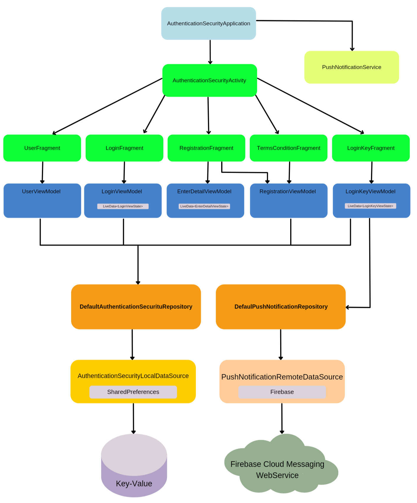

Authentication Security
=================

The app allows a two-step user authentication.

On first access, a token is generated for use in Firebase Cloud Messaging and a user registration is requested for authentication.

Afterwards, the defined authentication process starts in the following order:

1 - User login
* Occurs by checking the password that is stored locally in SharedPreferences.

2 - Access code validation
* The app makes a request to the Firebase Cloud Messaging web service with the Retrofit library, then a Push Notification with an access code is sent to the device.
* The user enters the access code or request a new Push Notification, if necessary.

The architecture is MVVM, with dependence injection Dagger and several Android Jetpack libraries.

Architecture
-----------

Screenshots (not dark)
-----------

Screenshots (dark)
-----------

Libraries Used
--------------
* Architecture - MVVM
  * Jetpack
  * Lifecycles
  * LiveData
  * Navigation
  * ViewModel
  * View binding
  * SharedPreferences
  * Notification
* UI
  * Fragment
  * Layout
  * Material Design
  * FragmentContainerView
  * ConstraintLayout
* Third party and miscellaneous libraries
  * Firebase Push Notification
  * Firebase Cloud Messaging
  * Firebase Console
  * Retrofit
  * Moshi
  * Dagger
  * Kotlin Coroutines
  

Upcoming features
-----------------
* Data Binding
* Binding expressions
* Binding Adapters
* Unit Tests
* Instrumentation Tests
* Preferences DataStore
* espresso
* junit